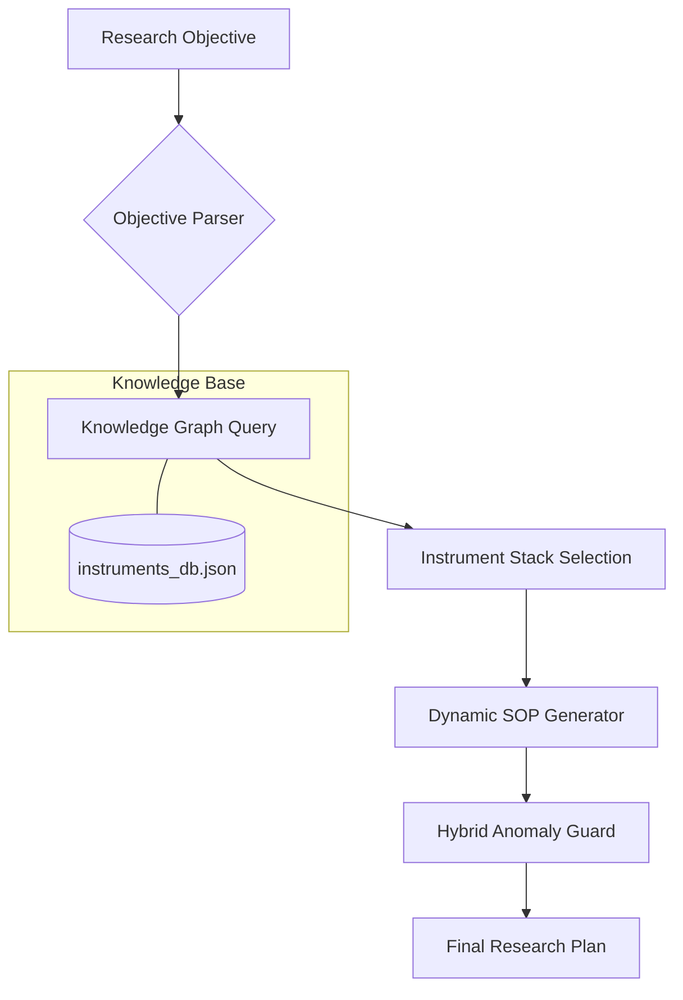

# 🌌 Scienti-QA: Scientific Decision Intelligence

> **Build India's AI-Driven Scientific Instrument & Research Intelligence Engine**

## 🌟 Overview
The **India Nobel Enablement (INE) Engine** is an advanced AI systems framework designed to automate scientific instrumentation selection and dynamic Standard Operating Procedure (SOP) generation. Unlike traditional chatbots, the INE-Engine utilizes **agentic orchestration** and **symbolic reasoning** to guide researchers through complex experimental setups.

This project was developed as a submission for the **I-STEM National AI Systems Internship**.

## 🛠️ Tech Stack
*   **Orchestration:** [LangGraph](https://github.com/langchain-ai/langgraph) (State-machine based agentic loops)
*   **Knowledge Indexing:** [LlamaIndex](https://github.com/run-llama/llama_index) (Hierarchical Scientific Knowledge Graphs)
*   **Edge Optimization:** [GGUF / NF4 Quantization](https://huggingface.co/docs/optimum/index) (for 100% offline laboratory deployment)
*   **Inference:** [llama-cpp-python](https://github.com/abetlen/llama-cpp-python) (Local performance optimization)

## 🏗️ Architecture
The engine follows a multi-node reasoning path:



### Core Nodes:
1.  **Objective Parser:** Translates high-level research goals into analytical requirements.
2.  **Instrument Taxonomy Node:** Queries a local Knowledge Graph to select the optimal "Instrument Stack."
3.  **SOP Generator:** Produces dynamic, step-by-step instructions tailored to the selected hardware.
4.  **Anomaly Guard:** A hybrid-AI safety layer that monitors simulated telemetry data against SOP constraints.

## 🚀 Getting Started (Offline Setup)
1.  **Clone the Repo:**
    ```bash
    git clone https://github.com/yourusername/ine-engine.git
    cd ine-engine
    ```
2.  **Install Dependencies:**
    ```bash
    pip install langgraph llama-index llama-cpp-python
    ```
3.  **Run the Engine:**
    ```bash
    python src/ine_engine.py
    ```

## 🔬 Scientific Impact
*   **Reduced Experimental Error:** Automated SOPs ensure consistent calibration across laboratories.
*   **Democratized Access:** Local, quantized models allow advanced decision intelligence to run on low-resource hardware in rural research centers.
*   **Sovereign AI:** 100% offline execution ensures sensitive research data never leaves the laboratory.

---
*Created by [Your Name] for the I-STEM National AI Systems Call (2026).*
